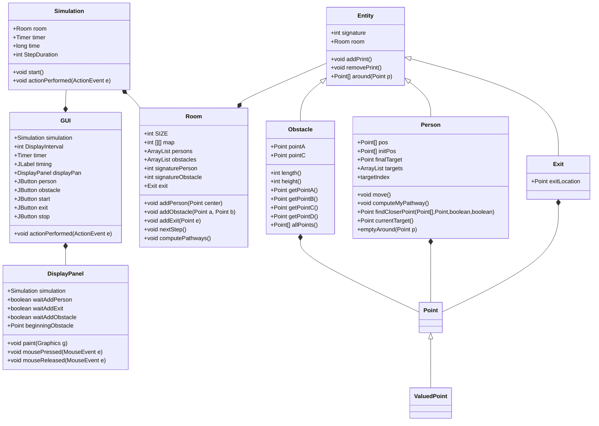

# Crowd simulator

## Specifications
The main goal of our crowd simulator is to observe the displacements of people in a room in the special case where they all want to reach the exit as soon as possible (for example because of a fire inside a building).
With more details, we also wanted to :

- Choose or create an environment 
- Choose where to put the obstacles, the exit and the danger
- Choose the number of people inside, their position
- Choose different types of behaviors (panic, calm, selfish, aware of their environment)

## Description of the problem
We knew we would have difficulties in making the people go to a special point avoiding being stuck by an obstacle.

## Principle of the algorithm
The principle is the following : for each person created, before they make any move, the algorithm computes the shortest path to the chosen exit.
Then 2 options follow : if the path is free, the person goes to the exit. If not, we add as an intermediate target the closest vertex of the obstacle. Then, we repeat the same method. When the whole path is computed, the point follows it.
We still have problems with this method since we can't put obstacles on the boundaries of the simulation area.

## Bibliographaaaïïïïïï

## UML diagram

## Possible improvements, bugs ...
We were not able to code the different behaviour a set of persons can have. We obviously could have make them completely stupid and code random trajectory for each point but this is not very interesting to observe.

## Diary

**Before week 0 :** We have got the idea of a crowd simulator by looking at the emergency stairs of the "beurk". We have done some research and chosen to use git with a github repository to work together more easily. We have written a first idea of the wanted [specifications](#Specifications).
We found that coding a crowd simulator is very interesting. We had the idea while looking at the exit doors in the INSA buildings.

**Week 0 :** We start the work division:

- Claire is in charge of the GUI.
- Violaine thinks about solutions for avoiding obstacles.
- Timothée starts to write the "Person" class.

**Week 1:** ...

...

## Implication of the members

|  Member  |Work done |
|----------|----------|
| Violaine | 33,3333% |
| Claire   | 33,3333% |
| Timothée | 33,3333% |
