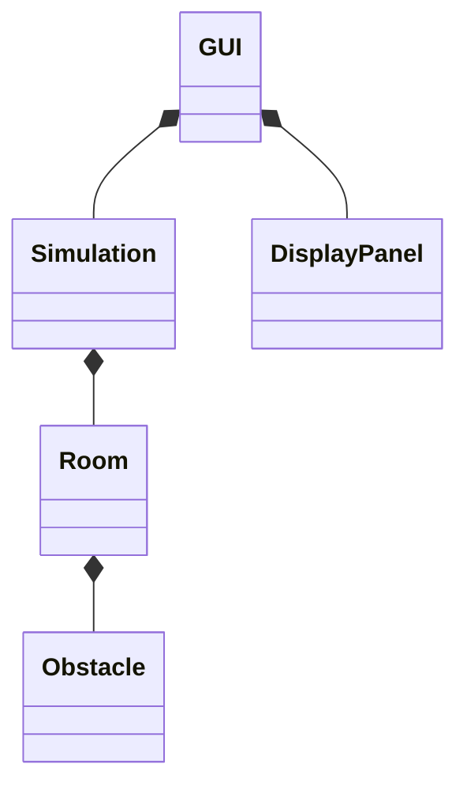

# Crowd simulator

## Specifications
## Description of the problem
## Principle of the algorithm
## Bibliographaaaïïïïïï
## UML diagram

## Possible improvement, bugs ...
## Diary
## Implication of the members

Violaine: 33,3333%

Claire:33,33333%

Timothée:33,33333%