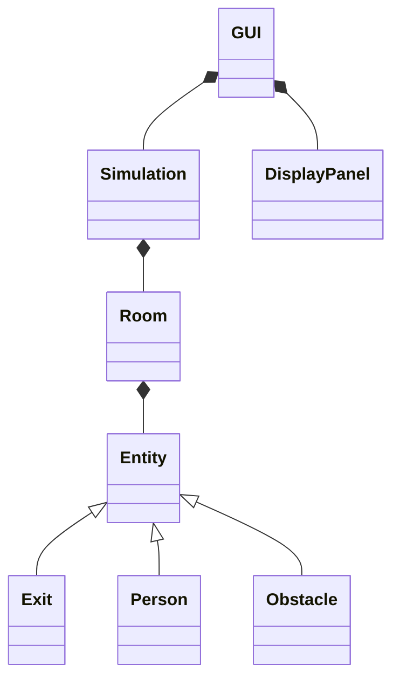

# Crowd simulator

## Specifications

The first idea of the specifications: <https://docs.google.com/document/d/1obRhZA8r9RrdMItQCydkv01Rpwv7F514io2gmuBxJi4/edit?usp=sharing>

## Description of the problem

## Principle of the algorithm

## Bibliographaaaïïïïïï

## UML diagram

## Possible improvements, bugs ...

## Diary

**Before week 0 :** We have got the idea of a crowd simulator by looking at the emergency stairs of the "beurk". We have done some research and chosen to use git with a github repository to work together more easily. We have written a first idea of the wanted specifications (see the "Specifications" section).

**Week 0 :** We start the work division:

- Claire is in charge of the GUI.
- Violaine thinks about solutions for avoiding obstacles.
- Timothée starts to write the "Person" class.

**Week 1:** ...

...

## Implication of the members

|  Member  |Work done |
|----------|----------|
| Violaine | 33,3333% |
| Claire   | 33,3333% |
| Timothée | 33,3333% |
